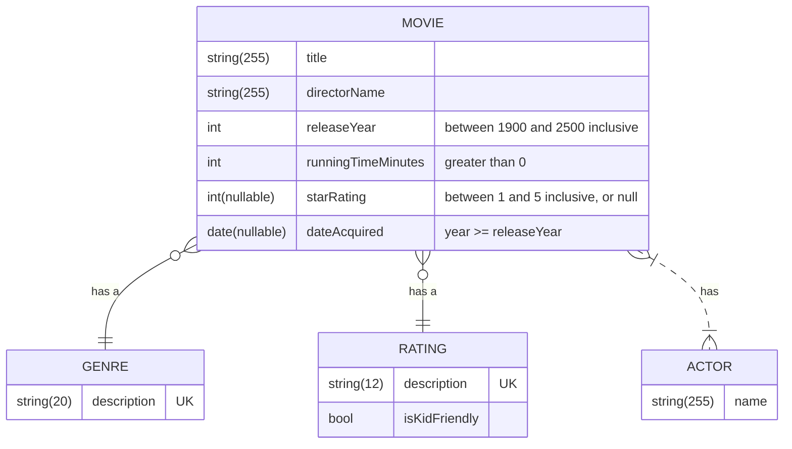

## MovieCollection
### Description
+ A relational database for a movie collection, implemented with SQL Server
+ CRUD operations for movies, genres, ratings, and actors
### About
Demonstrates:
+ Schema creation
+ Data seeding
+ One-to-many relationships
+ Many-to-many relationships
+ Stored procedures for inserts, updates, deletes
+ Views for selects
### Built with
+ Visual Studio Code
+ SQL Server Management Studio 20
+ SQL Server 2022
### Features / rules
+ TBA
### Improvement opportunities
+ TBA
### Supplemental documentation
#### Objectives
+ Demonstrate proficiency with SQL Server
+ Develop a database script that creates the database and its objects (schema, tables, relationships, indices, constraints, stored procedures, views, etc.)
+ Develop some kind of testing for database operations
#### ER Diagram

