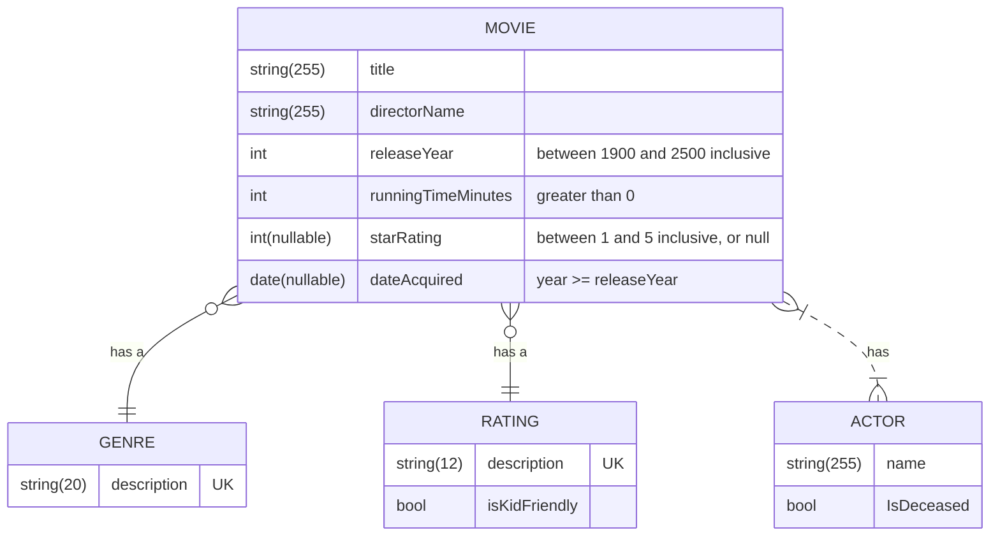

## MovieCollection
### Description
+ A relational database for a movie collection, implemented with SQL Server
+ CRUD operations for movies, genres, ratings, and actors
### Demonstrates
+ Schema creation
+ Data seeding
+ One-to-many relationships
+ Many-to-many relationships
+ Stored procedures for selects, inserts, updates, deletes
### Features
+ Actors/directors/genres with movies having kid-friendly rating
+ Add movie to actor
+ Count of movies by actor/director/genre/rating/release year/star rating
+ Create actor/movie
+ Delete actor/movie
+ Movies with details
+ Remove movie from actor
+ Total runtime by actor/director/genre/rating/release year
+ Update actor/movie
### Built with
+ SQL Server Management Studio 20
+ SQL Server 2022
+ Visual Studio Code
### Improvement opportunities
+ Implement an application role, permissions limited to views and stored procedures
+ Separation of commands and queries
+ Add testing
#### ER Diagram

### Rules
| # | Entity | Attribute | Rule |
|---|--------|-----------|------|
| 1 | Actor | Name | max length is 255 |
| 2 | Genre | Description | is unique |
| 3 | Genre | Description | max length is 20 |
| 4 | Movie | DateAquired | year is greater than or equal to release year |
| 5 | Movie | DirectorName | max length is 255 |
| 6 | Movie | ReleaseYear | is between 1900 and 2500 inclusive |
| 7 | Movie | RunTimeMinutes | is greater than zero (0) |
| 8 | Movie | StarRating | is null, or between 1 and 5 inclusive |
| 9 | Movie | Title | max length is 255 |
| 10 | Rating | Description | is unique |
| 11 | Rating | Description | max length is 12 |
